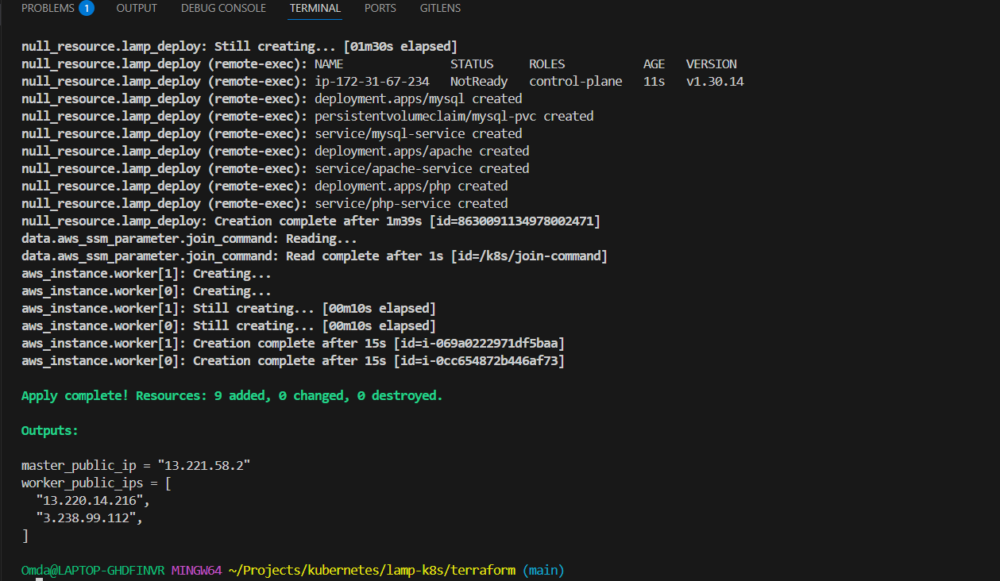
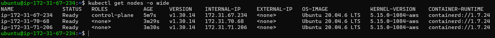
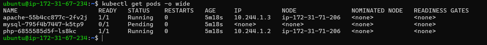
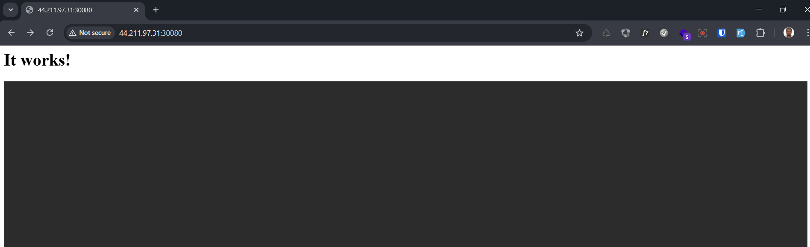

# Deploy LAMP Stack on K8s(Kubernetes) Using Terraform

Deploy a LAMP stack (Linux, Apache, MySQL, PHP) on an AWS-hosted Kubernetes cluster using Terraform.


---
## Structure

```sh
lamp-on-aws/
├── terraform/
│   ├── main.tf
│   ├── variables.tf
│   ├── outputs.tf
│   └── scripts/
│       ├── master.sh.tpl
│       ├── worker.sh.tpl
│       └── lamp-deploy.sh.tpl
├── kubernetes/
│   ├── apache/
│   │   ├── deployment.yaml
│   │   └── service.yaml
│   ├── php/
│   │   ├── deployment.yaml
│   │   └── service.yaml
│   └── mysql/
│       ├── deployment.yaml
│       ├── service.yaml
│       ├── pv.yaml
│       └── pvc.yaml

```

## Variables values

```sh
terraform apply -var-file="prod.tfvars"
```

## Run

```sh
cd terraform
terraform init
terraform apply
```

## Fix common files issue between Windows and Ubuntu

- Fix file issues for windows

```sh
dos2unix scripts/lamp-deploy.sh.tpl or sed -i 's/\r$//' scripts/lamp-deploy.sh.tpl
```

- Becarefull when using file provision you must use without slash to  copy all folder inside the kubernets

```sh
  provisioner "file" {
    source      = "../kubernetes" # wrong "../kubernetes/"
    destination = "/home/ubuntu/kubernetes/"
  }
```

## Steps To Deploy

- Run terraform scripts

```sh
terraform init
terraform apply --auto-approve -var-file="dev.tfvars"
```

- visit website (<http://44.211.97.31:30080>)

```sh
curl http://44.211.97.31:30080
```

## Screenshoots

- output deployment of the terraform


- list all connected nodes


- Pods list


- check apache website


Done..!
